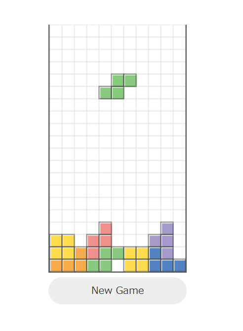

[](https://github.com/tkna/t4s/actions/workflows/ci.yml)
[](https://github.com/tkna/t4s/releases)

# t4s
`t4s` is a simple tetris-like game implemented by Kubernetes controllers.
Cluster users can play t****s in any time just by deploying a `T4s` resource.



## Description
This is not a tetris-like application on the cluster, but the composite of CRDs and controllers interact each other to run t****s.
All the information, such as the status of the game field and the descending block currently under control, are stored in custom resources and updated by reconciliation of the controllers. 

## Disclaimer
`t4s` may crush or slow down your cluster due to a heavy load on the control plane, especially if `T4s` resource is deployed on many namespaces.
Do not deploy it to a production environment.

## Quick start
1. Clone this repository
2. Create a kind cluster
```
$ make start
```
3. Deploy cert-manager
```
$ kubectl apply -f https://github.com/jetstack/cert-manager/releases/latest/download/cert-manager.yaml
```
4. Deploy t4s controllers
```
$ kubectl apply -f https://github.com/tkna/t4s/releases/latest/download/t4s.yaml
```
3. Deploy a `T4s` resource:
```
$ kubectl apply -f config/samples/t4s.yaml
```
4. Access `http://localhost:8080/` by your web browser


## Running on your cluster

### 1. Deploy cert-manager
```
$ kubectl apply -f https://github.com/jetstack/cert-manager/releases/latest/download/cert-manager.yaml
```

### 2. Deploy t4s controllers
```
$ kubectl apply -f https://github.com/tkna/t4s/releases/latest/download/t4s.yaml
```

### 3. Deploy T4s resource

Create and deploy a manifest like below:

- t4s.yaml
```
apiVersion: t4s.tkna.net/v1
kind: T4s
metadata:
  name: t4s-sample
spec:
  nodePort: 30080
```
```
$ kubectl apply -f t4s.yaml
```

By specifying `nodePort`, dedicated port will be exposed to the outside the cluster by the service `t4s-app`.
If you are using a local kind cluster, `extraPortMappings` is required to be set in advance to access the nodeport from the localhost.

If you don't specify `nodePort` like below, an ephemeral port is automatically exposed by Kubernetes.
```
apiVersion: t4s.tkna.net/v1
kind: T4s
metadata:
  name: t4s-sample
spec: {}
```

If you are using a k8s cluster which has `type: LoadBalancer` for instance EKS/GKE, `type: LoadBalancer` is also available by specifying `serviceType: LoadBalancer` like below:
```
apiVersion: t4s.tkna.net/v1
kind: T4s
metadata:
  name: t4s-sample
spec:
  serviceType: LoadBalancer
  loadBalancerSourceRanges:           # loadBalancerSourceRanges is also available
  - XXX.XXX.XXX.XXX/YY                # range of your source IP
```
For EKS, only CLB(Classic Load Balancer) is supported at this point.

### 4. Look up the LoadBalancer IP or DNS name (if needed)
- EKS

Get the external-ip (DNS name) of the service "t4s-app".
```
$ kubectl get svc t4s-app
NAME      TYPE           CLUSTER-IP       EXTERNAL-IP                                              PORT(S)          AGE
t4s-app   LoadBalancer   10.100.195.228   xxxxxxxxxxxxxxxxxxxxx.ap-northeast-1.elb.amazonaws.com   8000:30949/TCP   20s
```

- GKE

Get the external-ip of service "t4s-app".
```
$ kubectl get svc t4s-app
NAME      TYPE           CLUSTER-IP     EXTERNAL-IP      PORT(S)          AGE
t4s-app   LoadBalancer   10.36.10.168   XXX.XXX.XXX.XXX   8000:32175/TCP   15m
```

### 5. Access from the browser
- Access `http://<your-ip-or-DNS-name>:8000/` 
- Click "New Game"

## Operation
```
Left arrow: left
Right arrow: right
Up arrow: rotate
Down arrow: down (soft drop)
Space key: drop (hard drop)
```

## Limitation
- Only 1 `T4s` resource in a namespace
- No HTTPS support

## Development

- Create a kind cluster:
```
$ make start
```

- Launch tilt:
```
$ tilt up
```

- Tear down the kind cluster:
```
$ make stop
```

## Testing
### Test controllers
```
$ make test
```

### E2E Test
```
$ cd e2e
$ make test
```

### How it works
See [docs](./docs) directory.
