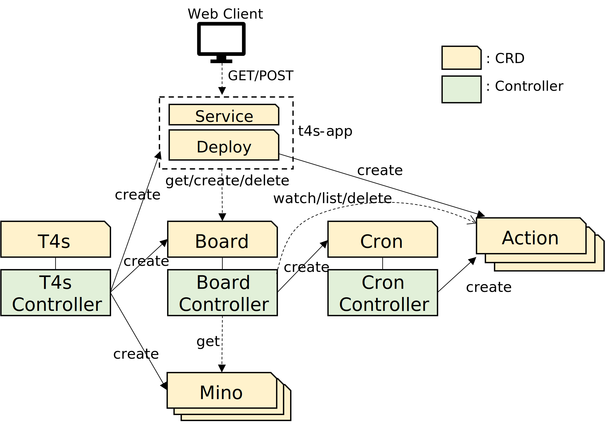
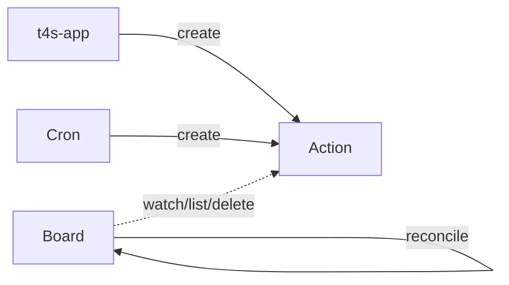

## Overall Architecture

## Terminologies
### Mino
Mino is the moving shaped piece which is generally called "tetromino". 

### Board
Board is the playing field where "minoes" descend and are fixed.

### CurrentMino
CurrentMino is the mino which is currently descending and under control on the board.

## CRDs
### T4s
T4s is a CRD which acts as the user interface. 
A user can deploy all the CRDs and related resources together by deploying a T4s.
The user can specify width/height of the board and wait time (the falling speed).
In addition, the user can specify the type of "service" to which the user accesses from a web client, and some of its parameters. 
Supported types of service are "NodePort" and "LoadBalancer" (default: NodePort).
`kubectl explain t4s.spec` for details.

### Board
Board CRD stores all the information related to the "board" in the "status" field, like status of each cell on the board, information of currently falling "mino", and the status of the game. 
Board controller watches Actions and start reconciling Board when a new Action is created.
Board controller lists Actions, handles with the first one, and then deletes it in a reconciliation.
If more than one Action is found, the second and subsequest ones are simply deleted.

### Cron
Cron controller reconciles periodically (for instance every 1 sec) to create "Actions" with "down" in the spec to periodically move the current mino downward.
Cron CRD has only 1 field 'period' in the spec, which represents the time period (in millisec) of periodic reconciliation.
Cron is created by the Board controller when the game is started and deleted when the game is over.

### Action
Action is an action request for the current mino. It has `op` field in the spec which specifies the request such as "down", "left", "right", "rotate", and "drop".
An Action is created by Cron(Controller) or t4s-app and consumed by Board(Controller). 

### Mino
Mino is for defining the shape and the color of a "mino". `t4s` reads 'built-in' minoes from configMap but you can add your own "minoes" by deploying mino resource.

## Other components
### t4s-app
t4s-app is a composite of a service named "t4s-app" and a deployment named "t4s-app". The deployment deployes the pods with a web server which translates the requests from the web client into the Kubernetes APIs.
The service exposes the deployment to the web client.
When the pod recieves an API request to start a new game, it deletes the current Board and recreates a new Board.
When the pod recieves an API request to move the current mino, it creates an Action using the Kubernetes API. 

### Web client
Web client is a simple client implemented by HTML/CSS and javascript, which is in charge of rendering the board and capturing the user operations.
The client simply polls the server (t4s-app) to get the latest board.
